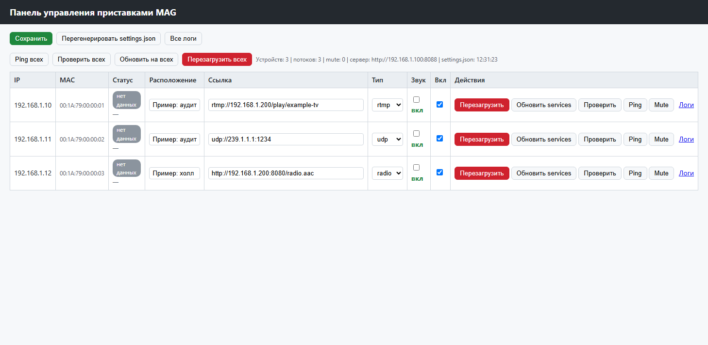

# MAG Portal

Портал и набор инструментов для IPTV-приставок **Infomir MAG** — в первую очередь
**MAG250**, а также других моделей линейки MAG со штатным JavaScript-API `gSTB`.
Проверено на **MAG250** (прошивка 7105, Linux 2.6.32, arch `sh4`).

Портал — компактная HTML/JS-страница, использующая JavaScript-API приставки
(`gSTB`, `stbPlayer`, `stbEvent`). Приставка открывает её по `file://`, а конфиг
потоков и логи получает/отправляет по HTTP на тестовый веб-сервер.

В репозиторий входят:

- **портал** (`ai_config/`) — шаблон + собранная страница;
- **панель управления** (`ai_config/www/`) — PHP-панель, приёмник логов, раздача
  `settings.json`;
- **инструменты** (`tools/`) — деплой на приставки по SSH, сбор данных, проверка
  воспроизведения.

## Структура

| Путь | Назначение |
|------|-----------|
| `ai_config/portal.template.html` | Шаблон портала (плейсхолдер `__SERVER_BASE__`) |
| `ai_config/services.html` | Собранный портал (кладётся на приставку) |
| `ai_config/www/` | Docroot веб-сервера: панель, `log.php`, **единый конфиг** `settings.json`, `devices.json` |
| `tools/` | `build_portal.py`, `deploy_services.py`, `mag_ctl.py`, `check_playback.py`, `collect_*.py` |
| `services.html` | Простейший пример сервисной страницы (один поток) |
| `devices.txt` | Список устройств для py-скриптов |
| `network_devices.md` | Инвентарь устройств (пример) |

## Поддерживаемые модели MAG (Infomir)

Проект обслуживает IPTV-приставки **Infomir MAG** через штатный **JavaScript-API `gSTB`**
(легаси-плеер `gSTB.Play`) и **SSH** (деплой, перезагрузка, сбор данных). Портал
кладётся в `/home/web/`.

- ✅ **Проверено:** **MAG250** — прошивка 7105 (2017), Linux 2.6.32, arch `sh4`,
  OpenSSH 5.1, браузер QtWebKit (уровень ES3); поток RTMP играет (`buff=100`).
- 🔶 **Ожидаемо совместимы** — та же JS-API `gSTB` и раскладка портала; требуется
  проверка на конкретной прошивке:

| Серия | Модели |
|-------|--------|
| MAG 2xx | MAG200, MAG250, MAG254, MAG270, MAG275 |
| MAG 3xx | MAG322, MAG324, MAG349, MAG350, MAG351 |
| MAG 4xx | MAG420, MAG424, MAG425 |
| MAG 5xx | MAG520, MAG524, MAG525 |
| Инфокиоск | MAG InfoKiosk (та же JS-API) |

**Условия совместимости:** включён SSH с входом по логину/паролю; портал в `/home/web/`;
поддержка кодека потока прошивкой приставки. На моделях с иной раскладкой портала или
закрытым SSH может потребоваться адаптация путей и версии `paramiko`.

### Почему эти модели

- Портал использует только документированные методы `gSTB`: `InitPlayer`, `SetStereoMode`,
  `SetVolume`, `Play`, `GetBufferLoad`, `GetPosTime`, `GetDeviceMacAddress`, `RDir` —
  они есть в JS-API MAG начиная с серии MAG200.
- Диагностика опирается на стандартные узлы прошивки: `/home/default/rdir.cgi`,
  `/proc/net/igmp`, `/proc/net/tcp`, `fw_printenv`.
- Деплой идёт по SSH через exec-канал (без SFTP) — старые MAG не отдают SFTP-подсистему.

### Форматы потоков

| Формат | Поддержка |
|--------|-----------|
| **RTMP** | ✅ рекомендуется для старых прошивок (MAG250 fw7105 — проверено) |
| **UDP multicast** (`udp://224.x`, `udp://239.x`) | ✅ через `gSTB.Play` |
| **HTTP/HLS** (`.m3u8`) | ⚠️ на MAG250 fw7105 не декодируется; на новых моделях зависит от прошивки |
| **RTSP** | ✅ API поддерживает; требуется проверка на конкретной модели |

> Ключевые слова: Infomir MAG, MAG250, MAG254, MAG270, MAG275, MAG322, MAG324,
> MAG349, MAG350, MAG351, MAG420, MAG425, MAG520, IPTV-приставка, портал, gSTB,
> JavaScript API, RTMP, HLS, UDP multicast, RTSP, автодеплой по SSH, PHP-панель.

## Требования

- **Python 3.8+** и `paramiko`:
  ```powershell
  pip install -r tools/requirements.txt
  ```
  ⚠️ Нужен **`paramiko>=3.4,<4`**: старые MAG (OpenSSH 5.1) принимают только
  host key `ssh-rsa`/`ssh-dss`, а paramiko 4.x удалил `ssh-rsa`.
- **PHP 8+** — для панели и приёма логов.

## Быстрый старт

1. **Настройте адрес сервера** в `ai_config/www/config.php`
   (или через переменные окружения `MAG_SERVER_HOST` / `MAG_SERVER_PORT`).

2. **Соберите портал** — адрес сервера подставляется в шаблон:
   ```powershell
   python tools/build_portal.py
   ```

3. **Запустите веб-сервер**:
   ```powershell
   php -S 0.0.0.0:8088 -t ai_config/www
   ```

4. **Разложите портал на приставки** (пароль — через `MAG_PASSWORD`):
   ```powershell
   $env:MAG_PASSWORD = '...'
   python tools/deploy_services.py --hosts 192.168.1.10
   ```

Подробнее: [`tools/README.md`](tools/README.md), [`MOVE-SERVER.md`](MOVE-SERVER.md),
[`ai_config/www/README.md`](ai_config/www/README.md), [`AGENTS.md`](AGENTS.md).

## Скриншоты

**Панель управления** — таблица устройств (IP, MAC, статус из `HEARTBEAT`), выбор
типа потока и кнопки: перезагрузка, обновление портала, проверка воспроизведения,
ping, mute, логи:



**Логи устройств** — список логов и просмотр хвоста с автообновлением:


## Безопасность

- Пароль SSH **не хранится в коде**: задавайте его аргументом `--password` или
  переменной окружения `MAG_PASSWORD`. Без пароля скрипты отказываются работать.
- Токен приёма логов в `ai_config/www/log.php` (`$LOG_TOKEN`), `ai_config/services.html`
  и `ai_config/portal.template.html` (`TOKEN`) должен совпадать — замените значение
  `change-me` на своё.
- Доступ к панели закрывайте Basic Auth средствами веб-сервера.
- `ai_config/www/mag_logs/` и `data/*.db` — рабочие данные, в git не хранятся.

## Особенности MAG250 (прошивка 7105)

- ⚠️ **HLS не декодируется** на этой прошивке — используйте **RTMP**.
- `gSTB.IsPlaying()` ненадёжен; реальный критерий — `GetBufferLoad()` + `GetPosTime()`.
- Тяжёлая обвязка (шимы, множество таймеров) ломает воспроизведение RTMP —
  портал держите компактным (см. `ai_config/portal.template.html`).

## Авторы

- **markovskiy.pavel** — [webxed@gmail.com](mailto:webxed@gmail.com), Telegram: [@exedd](https://t.me/exedd)
- **[deepseek 4.1](https://www.deepseek.com/)** — AI-ассистент (разработка, документация)

## Лицензия

[MIT](LICENSE).
